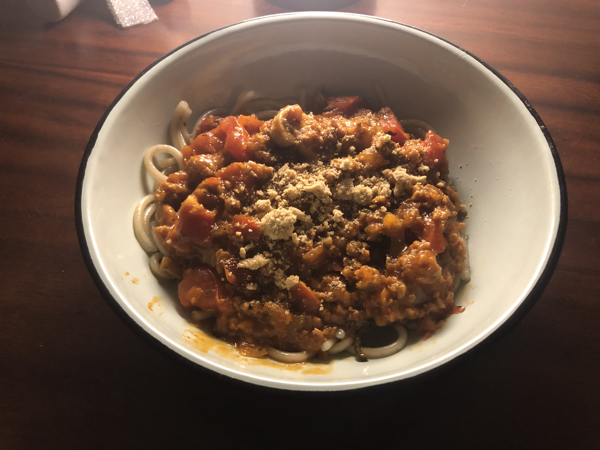

# "Beyond Meat" Mince Spaghetti Bolognaise

## Meta

- **Author:** Quintin Schnehage
- **Date:** 30 September 2020
- **Jetpacks:** Yes

_________________

- **Prep Time:** 15 Minutes
- **Cooking Time:** 30 Minutes

## Photos

## If it matters, this recipe is:

- Gluten-Free
- Soy-Free
- Meat, Egg and Dairy-Free

## Description

This is a fun vegan spin on mince spaghetti bolognaise. I came up with it one night, feeling like I wanted to experiment a bit, but it's a really easy dish to make. It was also *godlike* in its deliciousness and, if I do say so myself, worthy of the Flying Spaghetti Monster - Praise Be to His Noodley Appendages.

I decided for once that I wouldn't be afraid of overseasoning, so I used *all* of the **GitHerbs** in liberal quantities. Worked a treat.

For the spaghetti, I used gluten-free, garlic and *parse*-ly maize-based spaghetti, which tasted great! Normal wheat spaghetti is just fine, though.

I tried something a bit different, and made this quite hot and spicy. I also added some mushrooms that really soak up the flavour of the sauce and mince. I really like a bit of tart sweetness in my food, so I also added an unconventional touch — some fruit chutney.

We topped it off with some tasty vegan "parmesan" made up of powdered cashew nuts, sunflower seeds, herbs (oregano) and a bit of peri-peri sauce.

We didn't use a white sauce, but you could easily make some great vegan white sauce with almond milk and some cake flour.

## You will need:

### Equipment

- A large, broad-based, deep pan (or shallow pot / casserole dish)
- A medium sized pot for the spaghetti
- A cutting board. (preferably the kind that doesn't retain DNA evidence)
- Knives (Knives. Knives! **KNIVES.**)
- Therapy (but that's besides the point)
- *Optional:* A food processor to help mix herbs and prepare the parmesan.

### Main Ingredients

- 100g Spaghetti (We used gluten-free maize-based spaghetti)
- 450g "Beyond Beef" Plant-Based Ground Meat 453g
- 1 Large Onion (diced)
- 2 Cloves of Garlic (finely diced)
- 100g White Button Mushrooms (chopped)
- 5 Medium Tomatoes (chopped)
- 1 or 2 Jalapeno Chilis (finely diced)
- ±250ml Bolognaise Sauce (We used Dolmio)
- ±150ml Chutney (We used Mrs. Balls Original Recipe)
- Olive Oil
- Vegan Cheese (e.g. Violife)
- Powdered Sunflower Seeds
- Powdered Cashew Nuts

### Spices and Seasonings (GitHerbs)

- Basil
- Oregano
- Sage
- Rosemary
- Thyme
- Mint (Peppermint or Spearmint)
- Black Pepper
- Table Salt

## Cooking Instructions

### Prep

- Cut the **mushrooms** into quarters and set aside.
- Finely dice the **garlic** and set aside.
- Finely dice the **jalapeno peppers** and set aside.
- Peel and dice the **onion** and set aside. (I used a Nutribullet so I didn't cry from cutting it, and it actually worked quite well).
- Finally, the mince. Put the **Beyond Beef Ground Meat** on a cutting board. Work some of the **seasonings** (basil, oregano, sage, rosemary, thyme, salt and black pepper) and the **diced jalapeno peppers** into the mince. Knead and work the mince until the spices are evenly spread. Add in a small amount of the **diced onion** and **finely diced garlic** if you like.
- ***Wash your hands.*** Not just but because we're in a pandemic, but because Beyond Mince is oily AF. Ew.

### Cooking

#### Mince

- Heat a plate on the stove to medium-high setting.
- Put a little **olive oil** in the large broad-base pot or pan. Throw the remaining **diced onions** into the pot, and brown them over a minute or two.
- Add the **Beyond Beef Ground Meat** and the **finely diced garlic**.
- Stir and cook the mince and onions, adding in more spices and seasonings to taste. Continue until the meat is *brown*.
- Add all of the **chopped tomatoes** and the **Bolognaise Sauce**, and some **Chutney**.
- Add the **chopped mushrooms**. _Sacrifice their small, tender white bodies to the Spaghetti God, oh yes._
- Mix the mince mixture until it's evenly mixed and starting to simmer.
- At this point, taste the mince and _adjust your seasoning_ if you want. I added some more chutney, mint and sage and a bit of extra salt.
- You'll want to make sure all of the mince is covered by the liquid in the pan so that the mince and mushrooms can soak in the flavours as it simmers. If you need to, add in a bit of water. Then set aside on a low-medium heat and allow to simmer with the lid off.
- ***Stir regularly while the spagehtti cooks.***
- At this point I'd had a few drinks, and decided to add some **whiskey** to the mix. I don't know if we could even taste it in the end, but I thought why not. My judgement may have been impaired. ***NB: This makes the recipe non-gluten free.*** If we hadn't realised this, we may nearly have killed a friend of ours. 😅

#### Spaghetti

- Add some **water**, **olive oil**, and **salt** to taste to the pot.
- Bring to a boil.
- Add the spaghetti and cook until al dente.
- *Hint:* If you're using maize spaghetti, this tends to take longer to be cooked than normal spaghetti.

#### Toppings

- In a food processor (we used a Nutribullet), grind some cashew nuts, sunflower seeds, oregano to a fine powder for some tasty vegan parmesan. We also added a tiny splash of peri-peri sauce.

### Serve

- Spaghetti on the bottom.
- Mince in between.
- Grated Vegan Cheese and Vegan Parmesan on top.

## Gallery of Reference Images

- [Prep](images/Prep.jpg)
- [Mince Seasoning](images/Mince Seasoning.jpg)
- [Mince Ready](images/Mince Ready.jpg)
- [Mince Browned](images/Mince Browned.jpg)
- [Tomatoes and Bolognaise Sauce Added](images/Tomatoes.jpg)
- [Fruit Chutney Added](images/Chutney.jpg)
- [Mushrooms Added](images/Mushroooms.jpg)
- [Simmer](images/Simmer.jpg)
- [Extra Seasoning](images/Simmer Seasonings.jpg)
- [Spaghetti Cooking](images/Spaghetti.jpg)
- [Plated](images/Plated.jpg)
_________________

Enjoy! — Q

## Dog Tax (Snoekie)

